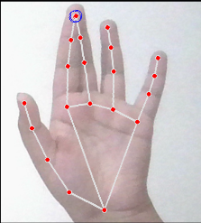

# Gesture Based Computer Control

## Description

Gesture Based Computer Control is a Python project that enables users to interact with a computer using gestures, voice commands, and other input methods. The project includes modules for gesture-based mouse control, facial and hand gesture recognition, voice-based triggers, canvas drawing, and a graphical user interface with multifunctional buttons.

## Features

- Gesture-based mouse control using MediaPipe and PyAutoGUI.
- Facial and hand gesture recognition for controlling screen brightness and volume.
- Voice-based triggers for executing commands using SpeechRecognition.
- Canvas drawing module with hand gestures using OpenCV and EasyOCR.
- Graphical user interface with multifunctional buttons using Tkinter.

## Installation

### Python

Download and install Python 3.11.5 for 64-bit from the official Python website: [Python Downloads](https://www.python.org/downloads/).

### Libraries

- Numpy
- OpenCV
- PyAutoGUI
- Tensorflow
- MediaPipe
- Tkinter
- SpeechRecognition
- EasyOCR
- Requests
- gTTS (Google Text-to-Speech)
- Screen-Brightness-Control
  
## Usage

1. Clone the repository:
2. Navigate to the project directory.
3. Run the desired Python script from the command line.
   ``python main.py``
5. Follow the on-screen instructions for each module.

## Images

## Contributors

- Suhaani Aggarwal - suhaaniaggarwal07@gmail.com
- Tejashree Bhangale - tejashree.bhangale@gmail.com
- Austin Paul - austinpaulanthony@gmail.com
- Sameer Bharambe - sameerbharambe6@gmail.com

## License

This project is licensed under the [MIT License](LICENSE).

---
